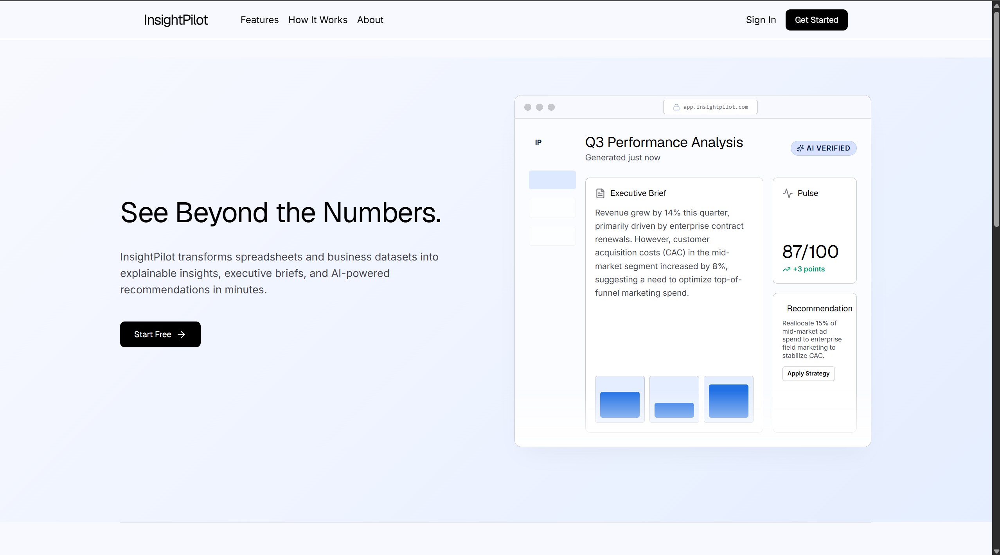
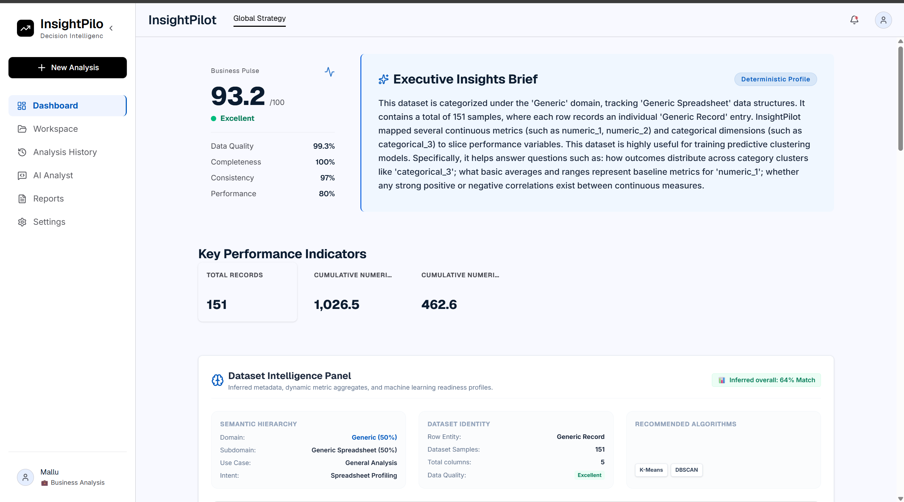
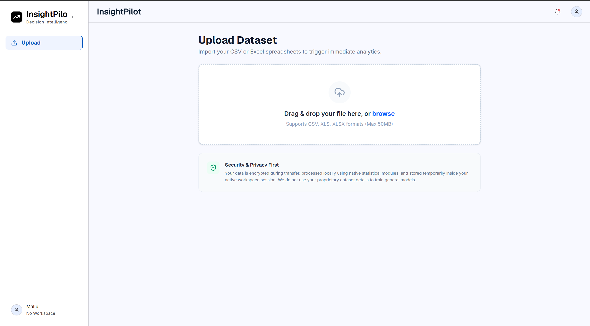
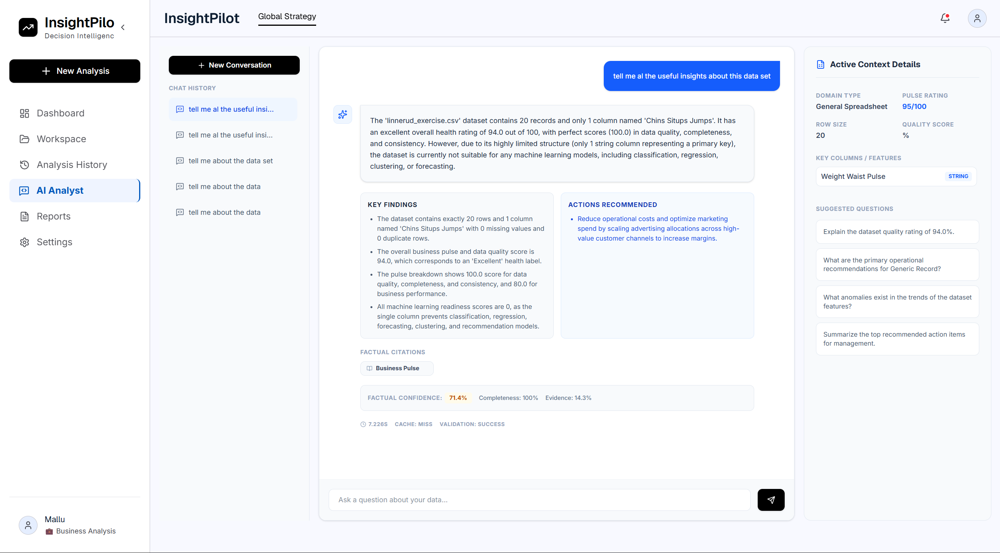
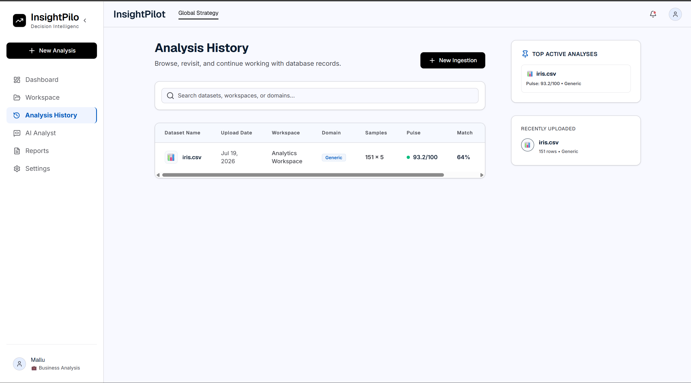
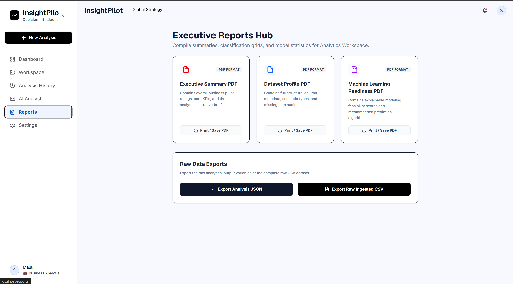
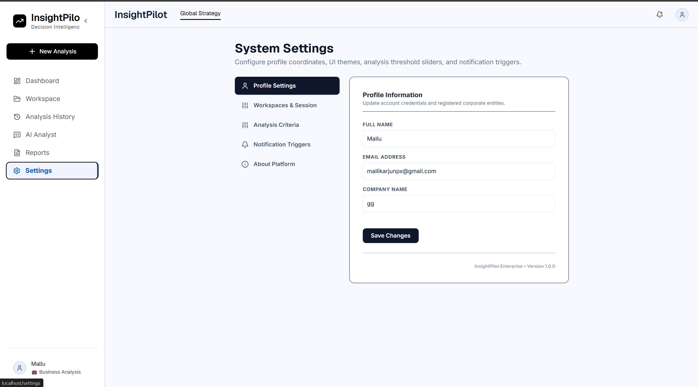
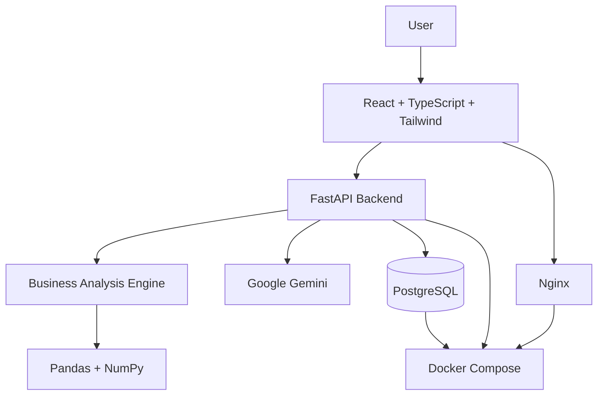

# 🚀 InsightPilot – AI-Powered Decision Intelligence Platform

> **See Beyond the Numbers. Make Better Business Decisions with AI.**

InsightPilot is an AI-powered Decision Intelligence Platform that transforms spreadsheets into executive insights, business reports, and AI-driven recommendations within minutes.

Instead of spending hours building dashboards or manually analyzing data, InsightPilot acts as your **AI Business Analyst**—understanding your data, uncovering hidden opportunities, identifying risks, and helping organizations make confident, data-driven decisions.

---

<p align="center">


</p>

# 📸 Product Preview

## 🏠 Landing Page


## 📊 Dashboard


## 📂 Upload Dataset


## 🤖 AI Business Analyst


## 📈 Analysis History


## 📄 Executive Reports


## ⚙️ Settings


# 💡 Why InsightPilot?

InsightPilot combines deterministic business analytics with Google's Gemini AI to transform raw spreadsheets into actionable business intelligence. Upload a dataset, explore insights, chat with an AI business analyst, and generate executive-ready reports—all from one platform.

# ✨ Key Features

- 📂 Smart Dataset Upload
- 📊 Automatic KPI Generation
- 🤖 AI Business Analyst
- 📈 Interactive Dashboard
- 📄 Executive Reports
- 📁 Workspace & Analysis History

# 🏗️ System Architecture



# 🛠️ Tech Stack

**Frontend:** React 19, TypeScript, Tailwind CSS, Vite

**Backend:** FastAPI, SQLAlchemy, Alembic, Pandas, NumPy, Uvicorn

**AI:** Google Gemini API

**Database:** PostgreSQL

**DevOps:** Docker, Docker Compose, Nginx

# 💻 Local Development

```bash
cd backend
python -m venv .venv
pip install -r requirements.txt
alembic upgrade head
uvicorn app.main:app --reload
```

```bash
cd frontend
npm install
npm run dev
```


# 🐳 Docker

```bash
docker compose up --build -d
docker compose logs -f
docker compose down
```


# 🔑 Environment Variables

```env
DATABASE_URL=postgresql://your_username:your_password@db:5432/insightpilot
GEMINI_API_KEY=your_api_key_here
GEMINI_MODEL=gemini-2.5-flash
```

# ☁️ Deployment

Deploy with Docker to AWS ECS/Fargate, using Amazon RDS for PostgreSQL and Amazon ECR for container images.

# 👨‍💻 Developed By

**Mallikarjun**

AI & Machine Learning Engineer

IBM SkillsBuild Project

# ⭐ If you like this project, consider giving it a star!
